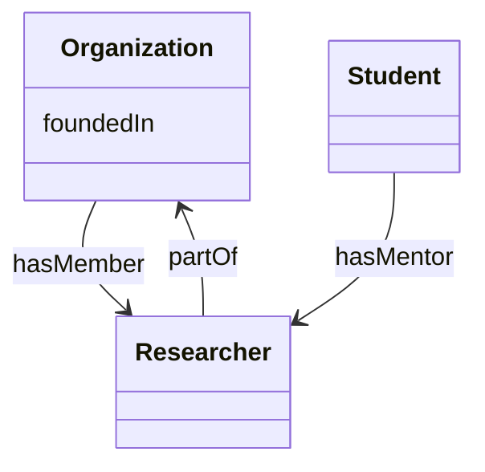

# Owl2diagram

## How to run locally
```

pip install owl2diagram==0.1.2

```

## How to use

   `python -m owl2diagram "https://dgarijo.github.io/example/release/1.0.1/ontology.ttl" output.md`


## Example

## Version

```
0.1.0
```

## Authors

- Jhon Toledo.
