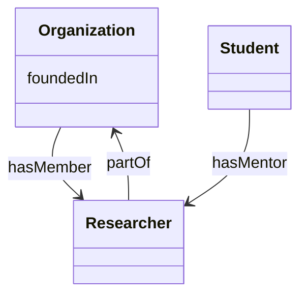

# Owl2diagram

Owl2diagram is a lightweight Python tool that transforms OWL ontologies into Mermaid class diagrams. It helps users quickly visualize the structure of an ontology by extracting classes, subclass relations, datatype properties, and object properties, and rendering them as a diagram that can be easily embedded in Markdown documentation, GitHub pages, or technical reports.

The tool is especially useful for ontology engineers, knowledge graph engineers, and researchers who want a simple way to inspect and communicate ontology structures.

## How to run locally

```

pip install owl2diagram==0.1.2

```

## How to use

   `python -m owl2diagram "https://dgarijo.github.io/example/release/1.0.1/ontology.ttl" output.md`

This command generates a Markdown file containing a Mermaid class diagram.

The tool can generate Mermaid diagrams including:

- OWL classes
- `rdfs:subClassOf` relations
- datatype properties attached to classes
- object properties connecting domain and range classes

## Example


```mermaid
	classDiagram

    
    class Organization {
    
    }

    class Researcher {
    
    }

    class Student {
    
    }


    

Organization  --> Researcher   :hasMember  

Student  --> Researcher   :hasMentor  

Researcher  --> Organization   :partOf  

    
    class Organization  {
    
    
        foundedIn  
     
    } 
    
```


## How it works

The package workflow is:

1. Load the ontology with `rdflib`
2. Run SPARQL queries to retrieve:
   - classes
   - subclass relations
   - datatype properties
   - object properties
3. Render Mermaid fragments using templates
4. Write the final result as a Markdown file containing a Mermaid code block

## Version

```
0.1.0
```

## Authors

- Jhon Toledo(`jatoledo`)
- Ahmad Alobaid (`ahmad88me`)
- María Poveda Villalón(`mariapoveda`)
