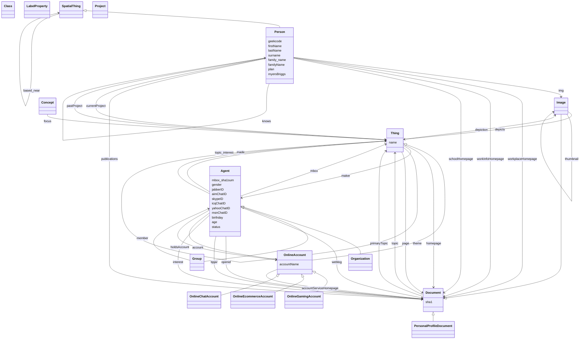

```mermaid
	classDiagram

    
    class Class {
    
    }

    class LabelProperty {
    
    }

    class Person {
    
    }

    class Agent {
    
    }

    class SpatialThing {
    
    }

    class Document {
    
    }

    class Organization {
    
    }

    class Group {
    
    }

    class Project {
    
    }

    class Image {
    
    }

    class PersonalProfileDocument {
    
    }

    class OnlineAccount {
    
    }

    class OnlineGamingAccount {
    
    }

    class OnlineEcommerceAccount {
    
    }

    class OnlineChatAccount {
    
    }


    
    SpatialThing <|-- Person 
    
    Agent <|-- Organization 
    
    Agent <|-- Group 
    
    Document <|-- Image 
    
    Document <|-- PersonalProfileDocument 
    
    Thing <|-- OnlineAccount 
    
    OnlineAccount <|-- OnlineGamingAccount 
    
    OnlineAccount <|-- OnlineEcommerceAccount 
    
    OnlineAccount <|-- OnlineChatAccount 
    

Agent  --> Thing   :mbox  

SpatialThing  --> SpatialThing   :based_near  

Thing  --> Document   :homepage  

Agent  --> Document   :weblog  

Agent  --> Document   :openid  

Agent  --> Document   :tipjar  

Agent  --> Thing   :made  

Thing  --> Agent   :maker  

Person  --> Image   :img  

Thing  --> Image   :depiction  

Image  --> Thing   :depicts  

Image  --> Image   :thumbnail  

Person  --> Document   :workplaceHomepage  

Person  --> Document   :workInfoHomepage  

Person  --> Document   :schoolHomepage  

Person  --> Person   :knows  

Agent  --> Document   :interest  

Agent  --> Thing   :topic_interest  

Person  --> Document   :publications  

Person  --> Thing   :currentProject  

Person  --> Thing   :pastProject  

Thing  --> Thing   :fundedBy  

Thing  --> Thing   :logo  

Document  --> Thing   :topic  

Document  --> Thing   :primaryTopic  

Concept  --> Thing   :focus  

Thing  --> Document   :page  

Thing  --> Thing   :theme  

Agent  --> OnlineAccount   :account  

Agent  --> OnlineAccount   :holdsAccount  

OnlineAccount  --> Document   :accountServiceHomepage  

Group  --> Agent   :member  

    
    class Agent  {
    
    
        mbox_sha1sum  
     
        gender  
     
        jabberID  
     
        aimChatID  
     
        skypeID  
     
        icqChatID  
     
        yahooChatID  
     
        msnChatID  
     
        birthday  
     
        age  
     
        status  
     
    } 
    
    class Person  {
    
    
        geekcode  
     
        firstName  
     
        lastName  
     
        surname  
     
        family_name  
     
        familyName  
     
        plan  
     
        myersBriggs  
     
    } 
    
    class Document  {
    
    
        sha1  
     
    } 
    
    class Thing  {
    
    
        name  
     
    } 
    
    class OnlineAccount  {
    
    
        accountName  
     
    } 
    
```